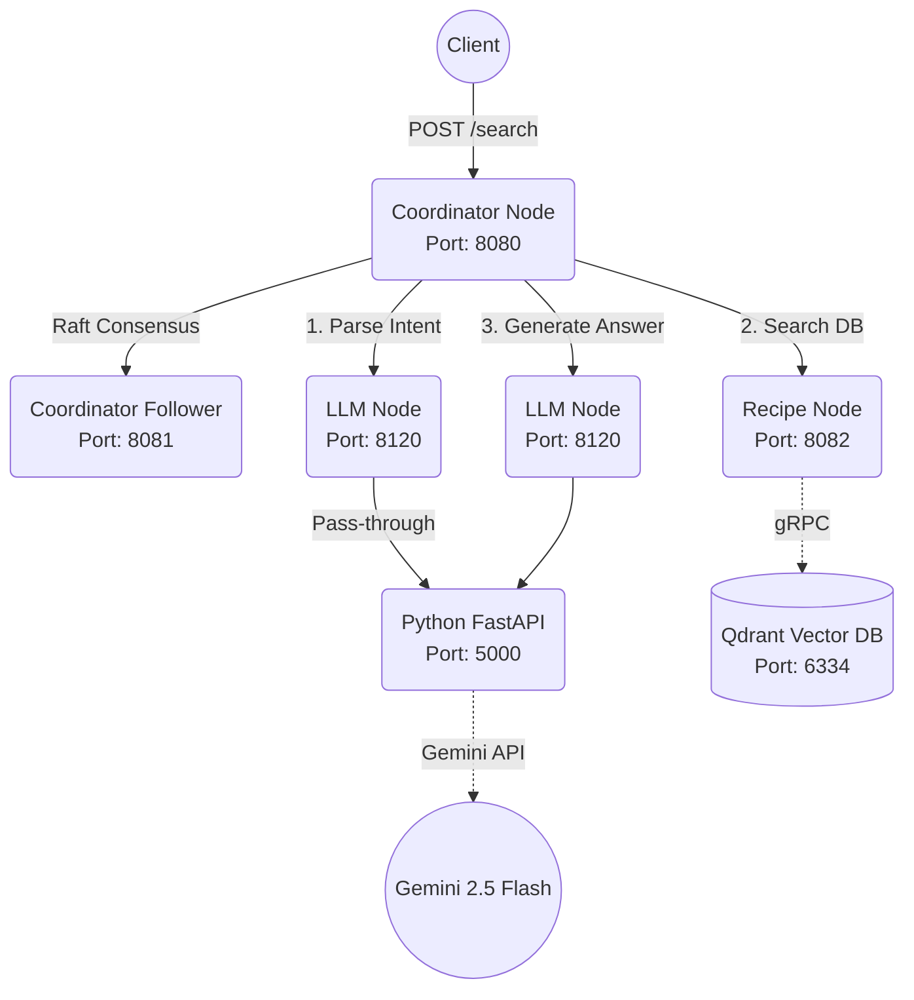

# Distributed Food Search System

A highly scalable, microservices-based distributed system that allows users to search for food recipes using natural language. The system leverages a custom Raft-based consensus orchestrator, Google's Gemini LLM for intent decomposition, and Qdrant Vector Database for semantic search.

## 🏗 System Architecture

The project is structured into three main interoperable microservices (nodes) and one shared library.



### Modules Overview

1. **`coordinator`**: The master orchestrator. Implements the Raft Consensus algorithm for high availability. It manages the state machine of incoming requests and delegates work sequentially to the other nodes.
2. **`llm-node`**: An AI Gateway consisting of a Spring Boot proxy and a Python/FastAPI backend. It uses LangChain and Gemini to decompose messy natural language into structured JSON filters, and later formats the search results into a conversational answer.
3. **`recipe-node`**: The search engine. It connects to a Qdrant Vector Database via gRPC. It applies both semantic vector search (using `sentence-transformers`) and metadata filtering to find the best recipes matching the decomposed criteria.
4. **`shared-models`**: A common Java library containing data transfer objects (DTOs) like `RecipeQuery` and `SearchResponse` used across all Spring Boot nodes.

---

## 🚀 Getting Started

### Prerequisites
- Java 17+ and Maven 3.8+
- Python 3.10+
- Docker & Docker Compose (for Qdrant)

### Environment Setup

Create a `.env` file at the root of `llm-node/python-llm-api/` with your API key:
```env
GOOGLE_API_KEY=your_gemini_api_key_here
```

### Running the System

You must start the components in the following order:

#### 1. Start Qdrant Database
```bash
docker run -p 6333:6333 -p 6334:6334 -v qdrant_storage:/qdrant/storage qdrant/qdrant
```

#### 2. Start Python Backend (`llm-node/python-llm-api`)
```bash
cd llm-node/python-llm-api
pip install -r requirements.txt
uvicorn app:app --host 127.0.0.1 --port 5000
```

#### 3. Start Java Nodes
Open three separate terminals at the root of the project and run:

**LLM Node Proxy (Port 8120):**
```bash
cd llm-node
mvn spring-boot:run
```

**Recipe Node (Port 8082):**
```bash
cd recipe-node
mvn spring-boot:run
```

**Coordinator Node (Port 8080):**
```bash
cd coordinator
mvn spring-boot:run
```

*(Optional) Register Workers to Coordinator:*
Depending on your exact cluster setup, you may need to register the worker nodes to the coordinator using the `/apply` endpoint.

---

## 🛠 API Usage

Send a natural language search request to the Coordinator:

```bash
curl -X POST http://localhost:8080/search \
  -H "Content-Type: application/json" \
  -d '{
    "userQuery": "I need a high protein dinner that takes less than 30 minutes to cook"
  }'
```

Returns a Tracking ID. Poll the result using:
```bash
curl -X GET "http://localhost:8080/get?id=<YOUR_TRACKING_ID>"
```
